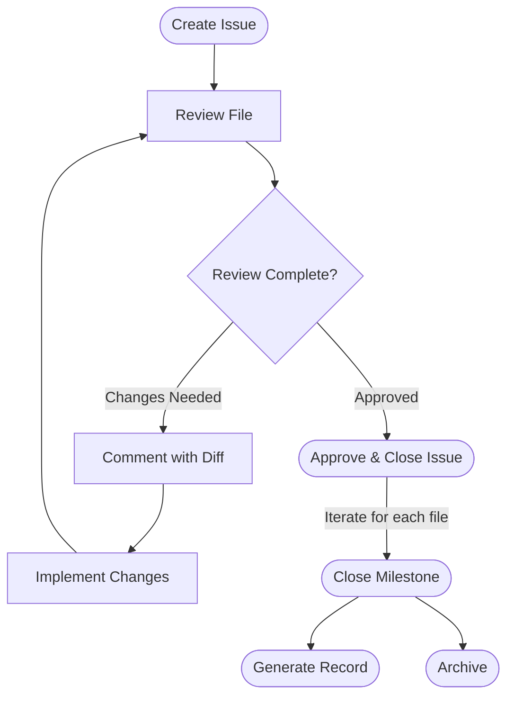

# ghqc

`ghqc` is a Quality Control (QC) management system for data analysis workflows. It uses **GitHub Issues** as the unit of tracking: each file under QC gets a GitHub Issue, issues are grouped into Milestones, and the full QC lifecycle is managed through `ghqc`.

Available as both an **interactive CLI** and an **embedded web UI**.

## QC Workflow



1. **Create** — Open a GitHub Issue for a file, assign a checklist and reviewers.
2. **Review** — The reviewer works through the checklist on GitHub.
3. **Comment** — Post a comment on the issue linking two commits, with an optional diff and note, to document changes made in response to review feedback.
4. **Iterate** — Repeat the review → comment cycle until the file is ready.
5. **Approve** — Close the issue with an approval comment pinning the reviewed commit.
6. **Record** — Generate a PDF summarizing the completed QC for a milestone.
7. **Archive** — Bundle the files into a zip archive.

## Features

### Issues

Each file under QC has a dedicated GitHub Issue. `ghqc` manages the full issue lifecycle:

| Command | Description |
|---|---|
| [`ghqc issue create`](docs/issue-create.md) | Create a new QC issue for a file |
| [`ghqc issue comment`](docs/issue-comment.md) | Post a comment with commit diff to document changes made (author) |
| [`ghqc issue review`](docs/issue-review.md) | Post a review comment comparing working directory to a commit (reviewer) |
| [`ghqc issue approve`](docs/issue-approve.md) | Approve the issue at a specific commit and close it |
| [`ghqc issue unapprove`](docs/issue-unapprove.md) | Reopen an approved issue with a reason |
| [`ghqc issue status`](docs/issue-status.md) | Print the QC status, git status, and checklist progress |

### Milestones

Issues are grouped into Milestones for organizational purposes.

| Command | Description |
|---|---|
| [`ghqc milestone status`](docs/milestone-status.md) | Tabular summary of all issues across selected milestones |
| [`ghqc milestone record`](docs/milestone-record.md) | Generate a PDF QC record for selected milestones |
| [`ghqc milestone archive`](docs/milestone-archive.md) | Generate a zip archive of the record and associated files |

### Configuration

`ghqc` reads checklists, a logo, and options from a separate configuration repository.

| Command | Description |
|---|---|
| [`ghqc configuration setup`](docs/configuration.md) | Clone the configuration repository |
| [`ghqc configuration status`](docs/configuration.md) | Display configuration directory and available checklists |

### Server

| Command | Description |
|---|---|
| [`ghqc ui`](docs/serve.md) | Start the embedded web UI server and open the browser (`ui` feature) |
| [`ghqc serve`](docs/serve.md) | Start the REST API server without the embedded UI (`api` feature) |

### Web UI

Running `ghqc ui` serves an embedded React application. The UI provides:

- **Status tab** — Kanban board of all issues, grouped by QC status
- **Create tab** — Wizard for creating new QC issues
- **Record tab** — PDF record generation with file upload for context pages
- **Archive tab** — Archive generation
- **Configuration tab** — Configuration repo setup and status

## Install

### CLI

```shell
cargo build --features cli --release
```

### API + Web UI

```shell
cargo build --features cli,ui --release
```

### Frontend Dev Server

```shell
cargo run --features cli,api -- serve --port 3104
cd ui && bun run dev
```

## Configuration

`ghqc` requires a configuration repository providing checklists, a logo, and optional settings. See the [configuration docs](docs/configuration.md) for full details.

Quick setup:

```shell
# Using environment variable
export GHQC_CONFIG_REPO=https://github.com/your-org/your-config-repo
ghqc configuration setup

# Or pass directly
ghqc configuration setup https://github.com/your-org/your-config-repo
```

An example configuration repository is available at [a2-ai/ghqc.example_config_repo](https://github.com/a2-ai/ghqc.example_config_repo).

## Documentation

- [Configuration](docs/configuration.md)
- [Issue: Create](docs/issue-create.md)
- [Issue: Comment](docs/issue-comment.md)
- [Issue: Review](docs/issue-review.md)
- [Issue: Approve](docs/issue-approve.md)
- [Issue: Unapprove](docs/issue-unapprove.md)
- [Issue: Status](docs/issue-status.md)
- [Milestone: Status](docs/milestone-status.md)
- [Milestone: Record](docs/milestone-record.md)
- [Milestone: Archive](docs/milestone-archive.md)
- [Serve / UI](docs/serve.md)
